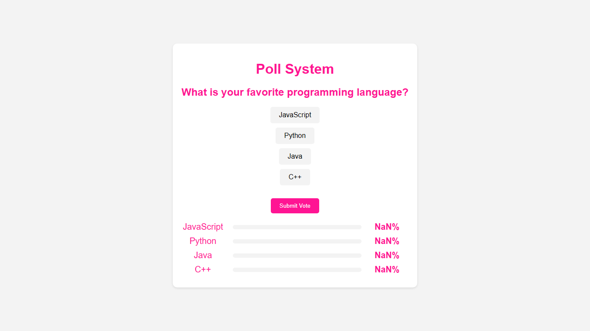
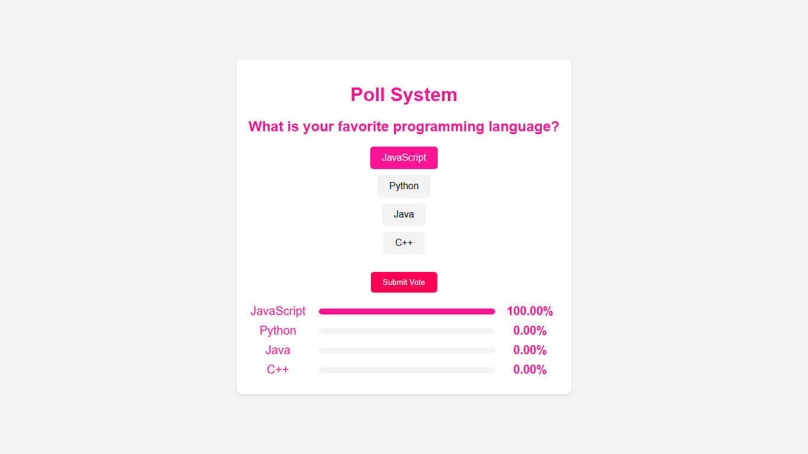

# Poll System

Poll System is a simple web application that allows users to vote for their favorite programming language and see the real-time results in a visually appealing format.

## Features

- Users can select their favorite programming language from a list of options.
- Real-time display of voting results with percentages and graphical representation.
- Easy-to-use interface with intuitive voting process.
- Option to submit votes and view results instantly.

## Technologies Used

## Screenshots

